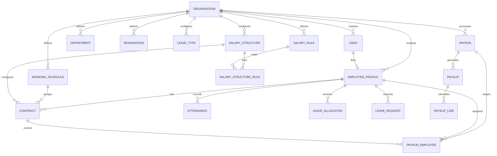
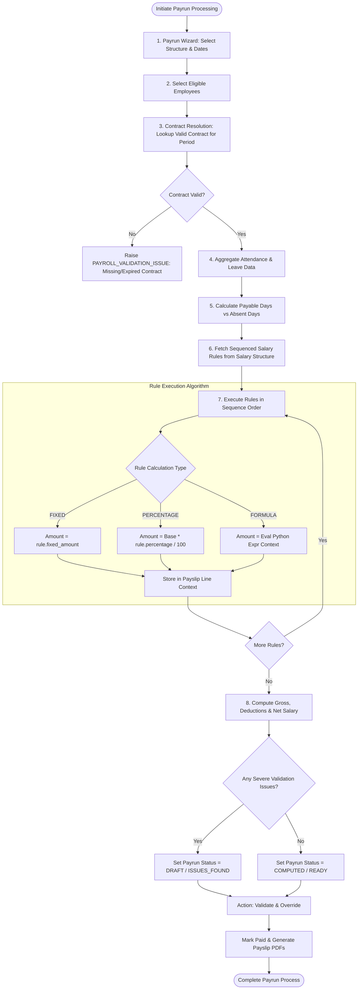
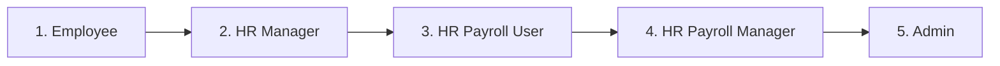

# WageWise (PeoplePay360): Technical Specification Document

**System Architecture, Data Schema, Engine Algorithms & API Specifications**

---

## 1. Executive Summary & Core Technical Vision

**WageWise** (internally code-named **PeoplePay360**) is an enterprise-grade, integrated Human Resource, Attendance, Time-Off, and Payroll Operations Platform. Built using a **Feature-First Clean Architecture**, WageWise eliminates data silos between core HR master data, employment contracts, weekly working schedules, attendance logging, leave approvals, salary rule engines, and automated payslip generation.

### Technical Mission Statement
> *"To provide a highly scalable, audit-compliant, asynchronous payroll engine and HR platform that seamlessly transforms raw operational logs (clock-ins, approved leaves, active contracts) into accurate, transparent, component-wise calculated payslips with sub-second execution performance."*

---

## 2. System Architecture & Component Topology

WageWise follows a decoupled client-server architecture utilizing an asynchronous Python/FastAPI backend and a React/Vite Single Page Application (SPA) frontend.

```mermaid
graph TD
    subgraph Client Layer ["Client Layer (Web Application)"]
        UI["React 19 SPA (Vite + TailwindCSS)"]
        State["State Management & API Client (Fetch/Axios)"]
    end

    subgraph Gateway Layer ["API Gateway / Reverse Proxy"]
        FastAPI["FastAPI App (ASGI Server / Uvicorn)"]
        Middleware["CORS, Exception Handlers & JWT Auth Middleware"]
    end

    subgraph Service Layer ["Backend Feature Modules (Feature-First Architecture)"]
        AuthMod["Auth Feature (/auth)"]
        OrgMod["Organization Feature (/organization)"]
        EmpMod["Employees & Contracts Feature (/employees)"]
        AttMod["Attendance & Schedule Feature (/attendance)"]
        LeaveMod["Time Off & Allocation Feature (/leave)"]
        PayrollMod["Payroll Engine Feature (/payrun, /payslip)"]
    end

    subgraph Data Layer ["Data & Persistence Layer"]
        Repo["Async SQLAlchemy 2.0 Repository Layer"]
        Migr["Alembic Database Migration Engine"]
        PG[("PostgreSQL 16 (Production) / SQLite (Development)")]
    end

    UI --> State
    State -->|RESTful JSON / HTTPS| Gateway Layer
    FastAPI --> Middleware
    Middleware --> Service Layer
    AuthMod & OrgMod & EmpMod & AttMod & LeaveMod & PayrollMod --> Repo
    Repo --> PG
    Migr --> PG
```

### Key Architectural Patterns
1. **Feature-First Organization**: Code is structured around domain modules (`app/features/auth`, `app/features/employees`, `app/features/contracts`, `app/features/payroll_config`, etc.), isolating business domains for enhanced modularity and maintainability.
2. **Layered Separation of Concerns**:
   - `router.py`: Handles HTTP routes, parameter binding, response serialization, and status codes.
   - `schemas.py`: Defines strong Pydantic v2 schemas for request validation and response typing.
   - `service.py`: Encapsulates business logic, transactional control, and workflow rules.
   - `repository.py` / `models.py`: Handles asynchronous SQLAlchemy 2.0 ORM interactions.
3. **Asynchronous I/O Engine**: Built ground-up with `async/await` using `asyncpg` for PostgreSQL or `aiosqlite` for local dev, ensuring high concurrent request throughput during batch payroll calculation runs.

---

## 3. Technology Stack & Key Dependencies

### Backend Technology Stack
| Category | Technology | Version | Purpose |
| :--- | :--- | :--- | :--- |
| **Language** | Python | 3.12+ | Primary application programming language |
| **Framework** | FastAPI | ^0.110.0 | High-performance ASGI Web Framework |
| **Server Engine** | Uvicorn | ^0.28.0 | ASGI web server for asynchronous execution |
| **ORM / Database Layer**| SQLAlchemy (Async) | ^2.0.28 | Asynchronous ORM and SQL toolkit |
| **Database Drivers** | `asyncpg` / `aiosqlite` | ^0.29 / ^0.20 | Asynchronous database connectors for Postgres / SQLite |
| **Schema Validation** | Pydantic | ^2.6.0 | Data parsing, type validation, and settings management |
| **Database Migrations** | Alembic | ^1.13.0 | Schema migration and version control engine |
| **Security & Auth** | PyJWT & Bcrypt | ^2.8 / ^4.1 | JWT token creation/verification & password hashing |
| **Testing Engine** | Pytest & pytest-asyncio | ^8.1 / ^0.23 | Asynchronous unit and integration test framework |

### Frontend Technology Stack
| Category | Technology | Version | Purpose |
| :--- | :--- | :--- | :--- |
| **UI Library** | React | ^19.2.8 | Declarative component-driven user interface framework |
| **Build Tooling** | Vite | ^8.2.2 | Fast frontend tooling & hot-module-reloading environment |
| **Styling Framework** | TailwindCSS | ^4.3.3 | Utility-first CSS framework for custom responsive design |
| **Iconography** | Lucide React | ^1.41.0 | Clean, accessible vector icons |
| **Linting & Quality** | ESLint | ^10.9.0 | Static analysis and style enforcement |

---

## 4. Entity Schema & Data Architecture

The underlying database schema consists of 21 core entities defined in [`schema.mmd`](file:///c:/Coding/Hackathon/odoo-hackathon/docs/Diagrams/schema.mmd), ensuring multi-tenant capability, relational consistency, and comprehensive auditability.



### Primary Entity Definitions

#### 1. Core HR & Organization Domain
- **`ORGANIZATION`**: Multi-tenant isolation anchor (`_id`, `name`, `code`, `currency`, `timezone`, `country`).
- **`USER`**: Authentication principal (`_id`, `organization_id`, `email`, `password`, `role`, `status`, `token_version`).
- **`EMPLOYEE_PROFILE`**: Central HR master record (`_id`, `user_id`, `organization_id`, `department_id`, `designation_id`, `manager_id`, `employee_id`, `joining_date`, `employment_type`, `pan_number`, `aadhaar_number`).
- **`DEPARTMENT` & `DESIGNATION`**: Organizational hierarchy structures (`_id`, `organization_id`, `name`/`title`, `code`, `manager_id`).
- **`BANK_ACCOUNT`**: Employee banking details (`_id`, `employee_id`, `account_number`, `ifsc_code`, `bank_name`, `is_primary`).

#### 2. Contracts & Working Schedules
- **`WORKING_SCHEDULE`**: Weekly expectation definition (`_id`, `organization_id`, `hours_per_day`, `hours_per_week`, `working_days`, `start_time`, `end_time`, `break_minutes`).
- **`CONTRACT`**: Historical & active employment terms (`_id`, `employee_id`, `working_schedule_id`, `salary_structure_id`, `contract_number`, `start_date`, `end_date`, `base_wage`, `wage_type`, `status`).

#### 3. Time, Attendance & Leaves
- **`ATTENDANCE`**: Daily operational log (`_id`, `employee_id`, `date`, `clock_in`, `clock_out`, `work_hours`, `overtime_hours`, `status`).
- **`ATTENDANCE_CORRECTION`**: Workflow requests for manual check-in/out fixes (`_id`, `attendance_id`, `requested_by`, `requested_clock_in`, `requested_clock_out`, `reason`, `status`, `reviewed_by`).
- **`LEAVE_TYPE`**: Policy definitions (`_id`, `organization_id`, `name`, `code`, `default_days`, `is_paid`, `carry_forward`, `requires_approval`).
- **`LEAVE_ALLOCATION`**: Granted balance records (`_id`, `employee_id`, `leave_type_id`, `year`, `allocated_days`, `used_days`, `remaining_days`).
- **`LEAVE_REQUEST`**: Applied time-off requests (`_id`, `employee_id`, `leave_type_id`, `start_date`, `end_date`, `days`, `status`, `reviewed_by`).

#### 4. Configurable Payroll & Execution Engine
- **`SALARY_STRUCTURE`**: Container for execution rules (`_id`, `organization_id`, `name`, `code`, `is_default`, `is_active`).
- **`SALARY_RULE`**: Calculation logic units (`_id`, `organization_id`, `name`, `code`, `category`, `calculation_type`, `fixed_amount`, `percentage`, `percentage_base`, `formula`, `sequence`, `taxable`, `is_statutory`).
- **`SALARY_STRUCTURE_RULE`**: Junction table maintaining strict rule execution sequence (`_id`, `salary_structure_id`, `salary_rule_id`, `sequence`).
- **`PAYRUN`**: Payroll batch processing container (`_id`, `organization_id`, `name`, `period_start`, `period_end`, `month`, `year`, `status`, `total_gross`, `total_deductions`, `total_net`, `created_by`, `finalized_by`).
- **`PAYRUN_EMPLOYEE`**: Pre-flight operational snapshot per employee (`_id`, `payrun_id`, `employee_id`, `contract_id`, `payable_days`, `worked_days`, `leave_days`, `absent_days`, `overtime_hours`, `gross_salary`, `net_salary`, `is_ready`).
- **`PAYROLL_VALIDATION_ISSUE`**: Pre-calculation warning ledger (`_id`, `payrun_id`, `employee_id`, `issue_code`, `category`, `severity`, `title`, `description`, `status`).
- **`PAYSLIP`**: Final computed payslip header (`_id`, `payrun_id`, `employee_id`, `contract_id`, `payslip_number`, `basic_salary`, `gross_salary`, `total_earnings`, `total_deductions`, `net_salary`, `status`, `pdf_url`).
- **`PAYSLIP_LINE`**: Computed breakdown component (`_id`, `payslip_id`, `salary_rule_id`, `name`, `code`, `category`, `base_amount`, `rate`, `amount`, `sequence`).

---

## 5. Payroll Computation Engine & Algorithms

The core strength of WageWise lies in its period-aware contract matching, attendance integration, and sequenced rules engine.



### Rule Execution Sequence & Formula Processing

Salary Rules belong to standardized categories executing strictly in numerical `sequence` order:

1. **`BASIC` (Seq: 10-99)**: Evaluates base earnings derived from the active contract (`contract.base_wage`).
2. **`ALLOWANCE` (Seq: 100-299)**: Evaluates additions (HRA, Transport, Special Allowances). Can be fixed or percentage of `BASIC`.
3. **`GROSS` (Seq: 300-399)**: Computes aggregate gross earnings (`BASIC + sum(ALLOWANCES)`).
4. **`DEDUCTION` / `STATUTORY` (Seq: 400-899)**: Evaluates tax withholdings, Provident Fund (PF), Professional Tax (PT), and attendance proration deductions.
5. **`NET` (Seq: 900+)**: Computes final net payable amount (`GROSS - sum(DEDUCTIONS)`).

#### Formula Evaluation Context
For formula-based rules, the execution engine injects a safe Python evaluation context containing:
- `contract`: Current contract properties (`contract.base_wage`, `contract.wage_type`).
- `worked_days`, `payable_days`, `leave_days`, `absent_days`.
- `categories`: Dictionary holding computed totals of previous categories (e.g., `categories['BASIC']`, `categories['GROSS']`).
- `rules`: Dictionary holding individual rule results by code (e.g., `rules['HRA'].amount`).

---

## 6. API Specifications & Route Architecture

The RESTful API is served under the `/api/v1` prefix. All protected endpoints require a `Bearer <JWT_ACCESS_TOKEN>` header.

### 1. Authentication & System Health (`/auth`, `/health`)
- `POST /api/v1/auth/register`: User registration & organization setup.
- `POST /api/v1/auth/login`: Authenticates credentials; returns JWT access & refresh tokens.
- `POST /api/v1/auth/refresh`: Issues a new access token using a valid refresh token.
- `GET /api/v1/auth/me`: Fetches authenticated user profile & assigned permissions.
- `GET /health`: Basic health ping.
- `GET /health/db`: Deep asynchronous database ping and driver latency test.

### 2. Employee & Contract Management (`/employees`, `/contracts`)
- `GET /api/v1/employees`: Lists employees (supports Kanban/List views, search & filtering).
- `POST /api/v1/employees`: Creates a new employee record (HR Manager+).
- `GET /api/v1/employees/{id}`: Retrieves comprehensive employee profile details.
- `PUT /api/v1/employees/{id}`: Updates employee record.
- `GET /api/v1/employees/{id}/contracts`: Fetches all historical and active contracts for an employee.
- `POST /api/v1/contracts`: Creates a new contract with period validity checks.

### 3. Attendance & Time Off (`/attendance`, `/leave`)
- `POST /api/v1/attendance/clock-in`: Clock-in event for employee.
- `POST /api/v1/attendance/clock-out`: Clock-out event for employee.
- `GET /api/v1/attendance`: Returns attendance logs with exception flags (late, missing check-out).
- `POST /api/v1/attendance/corrections`: Submits attendance correction request.
- `GET /api/v1/leave/types`: Lists configured leave types.
- `GET /api/v1/leave/balances`: Retrieves remaining leave balances for employee.
- `POST /api/v1/leave/requests`: Submits leave request.
- `PUT /api/v1/leave/requests/{id}/approve`: Approves leave request & updates allocation balance.

### 4. Payroll Configuration & Payruns (`/payroll`)
- `GET /api/v1/payroll/structures`: Lists configured salary structures.
- `POST /api/v1/payroll/structures`: Creates salary structure and sequences rules (Payroll Manager+).
- `GET /api/v1/payroll/rules`: Lists salary rules.
- `POST /api/v1/payroll/payruns/wizard`: Initiates 2-step payrun setup & employee selection.
- `POST /api/v1/payroll/payruns/{id}/compute`: Triggers batch salary computation algorithm.
- `POST /api/v1/payroll/payruns/{id}/validate`: Validates payroll records and issues warnings.
- `POST /api/v1/payroll/payruns/{id}/mark-paid`: Finalizes payrun and locks records.
- `GET /api/v1/payroll/payslips/{id}/pdf`: Renders/downloads printable PDF payslip.

---

## 7. Security Architecture & Role-Based Access Control (RBAC)

WageWise implements strict fine-grained authorization across 5 hierarchical roles.



### Role Permission Matrix
| Module / Capability | Employee | HR Manager | HR Payroll User | HR Payroll Manager | Admin |
| :--- | :---: | :---: | :---: | :---: | :---: |
| **Personal Profile & Payslips** | Read | Read | Read | Read | Read/Write |
| **Clock In / Out & Leave Request** | Create | Create | Create | Create | Create |
| **Employee & Contract Mgmt** | None | Full | Full | Full | Full |
| **Attendance Exceptions & Corrections**| None | Approve | Approve | Approve | Full |
| **Payrun Creation & Computation** | None | None | Create/Compute | Full | Full |
| **Salary Rules & Structure Config** | None | None | Read Only | Full | Full |
| **User Roles & Security Admin** | None | None | None | None | Full |

### Cryptographic Protocols & Governance
- **Password Protection**: Passwords are hashed using `bcrypt` with a minimum cost factor of 12.
- **JWT Standard**: Tokens use `HS256` signature algorithm with configurable expiry (`ACCESS_TOKEN_EXPIRE_MINUTES = 15`, `REFRESH_TOKEN_EXPIRE_DAYS = 7`).
- **Audit Ledger**: Every write operation (Create, Update, Delete) on sensitive contracts, salary rules, and payruns generates an immutable record in `AUDIT_LOG` containing `user_id`, `action`, `resource_type`, `before` state snapshot, `after` state snapshot, IP address, and timestamp.

---

## 8. Deployment, Infrastructure & DevOps Strategy

WageWise is fully containerized using Docker and Docker Compose for seamless deployment across environment tiers.

### Production Containerization Overview

```yaml
version: '3.8'

services:
  backend:
    build:
      context: ./backend
      dockerfile: Dockerfile
    ports:
      - "8000:8000"
    environment:
      - ENVIRONMENT=production
      - DATABASE_URL=postgresql+asyncpg://postgres:postgrespassword@db:5432/peoplepay360
    depends_on:
      db:
        condition: service_healthy

  db:
    image: postgres:16-alpine
    restart: always
    environment:
      POSTGRES_USER: postgres
      POSTGRES_PASSWORD: postgrespassword
      POSTGRES_DB: peoplepay360
    ports:
      - "5432:5432"
    healthcheck:
      test: ["CMD-SHELL", "pg_isready -U postgres"]
      interval: 5s
      timeout: 5s
      retries: 5
```

### Alembic Database Migrations Workflow
1. **Migration Autogeneration**:
   ```bash
   alembic revision --autogenerate -m "Add payrun validation issues table"
   ```
2. **Asynchronous Migration Execution**:
   ```bash
   alembic upgrade head
   ```

### Quality Assurance & Verification
- **Backend Test Suite**: Verified via `pytest` executing async integration tests against an isolated SQLite memory database or PostgreSQL instance.
- **Frontend Verification**: Clean build check via `npm run build` and static linting via `eslint .`.

---

*Document Author: WageWise Engineering Team*  
*Last Updated: September 2026*
